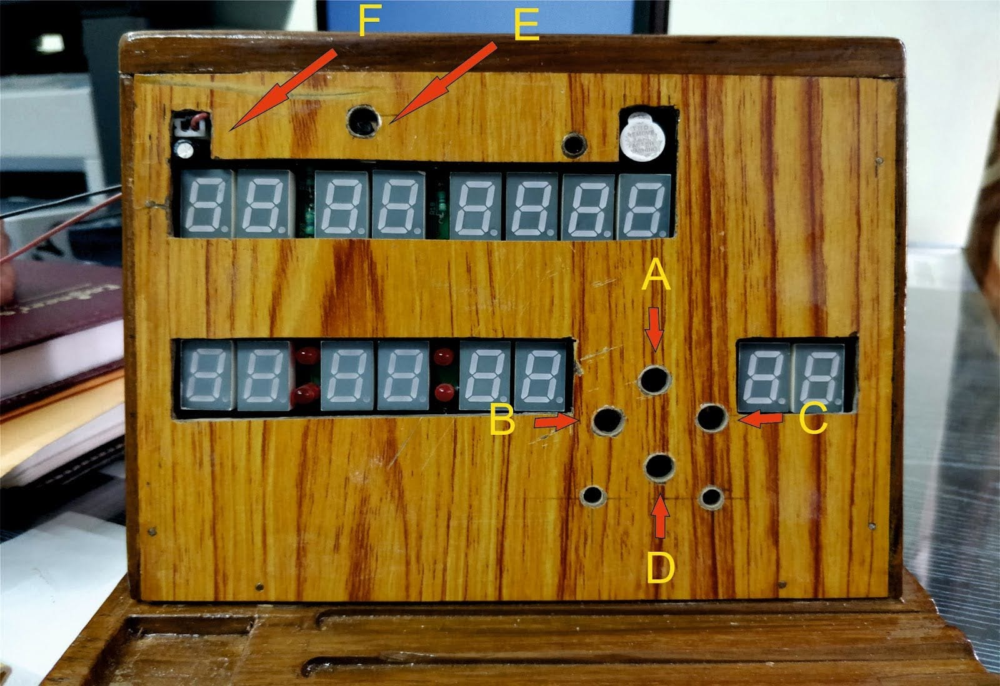

# RTC-clock
An RTC clock to display Date, Time and room temperature on a 7 segment LED display. The main code is developed by me, while the header files for DHT11 and DS1307 has been taken from respective sources mentioned in the files.

# Instruction Manual

## Buttons
### A - Mode switch:
Change modes (Cyclic order - set Alarm, set Date, set Time, Display).
### B - Down switch: 
Decrement the value while setting.
### C - Up switch:
Increment the value while setting
### D - Set switch:
Set the value of a block and move to the next (block means 2 digits). 
>**_NOTE:_** This switch is cyclic in nature, which means it will go back to the first block when pressed from the last block going rightwards.
### E - Alarm ON/OFF switch:
OFF when in downwards position, ON when in upwards position
### F - Reset switch: 
For hard reset of the circuit. The set alarm will be cleared if pressed.
## Modes
### Display Mode
In this mode, the current date will be displayed in DD MM YYYY format in the top line. The  current time will be displayed below in the HH:mm:SS format. The bottom right digits show the the room temperature. The LEDs below the buttons show the AM/PM (left for AM and right for PM).
### Set Alarm Mode
This mode is entered when the mode switch is pressed once from the normal display mode. The alarm is first initialized to 1:00 AM. You start by setting the hours block, then press the set switch, now set the minutes block, now press the set switch, now you can set AM or PM. Press mode switch to enter the next mode and save the changes.
>***_NOTE:_*** The Alarm ON/OFF switch can be used to enable or disable the alarm.
### Set Date Mode
This mode is entered when the mode switch is pressed once from the set alarm mode. You start with setting the day block, then press the set switch, then set the month block, press set switch, set the first 2 digits of the year block, press set, and then the last 2 digits of the year finally. Press mode switch to enter the next mode and save the changes.
### Set Time Mode
This mode is entered when the mode switch is pressed once from the set date mode. You start with setting the hour block, then press the set switch, then set the minutes block, press set switch, now set the seconds, press the set switch and finally set AM or PM. Note that, if no change is made in this mode then, the time will not be updated thus revert back to the current real time. 

